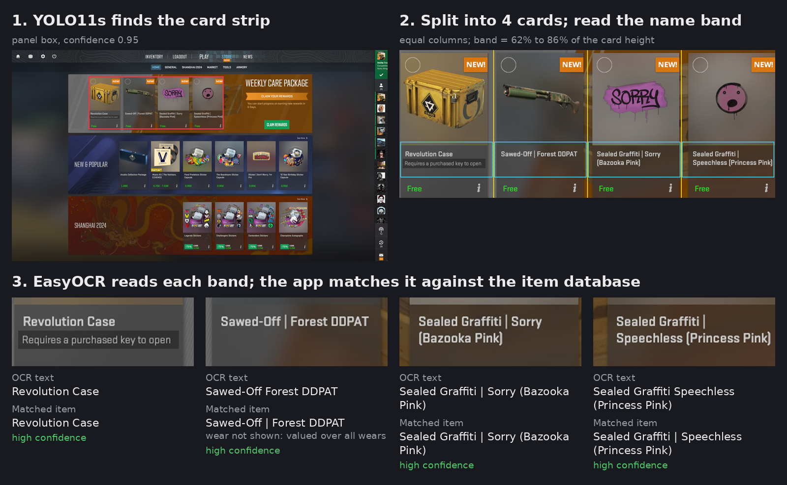
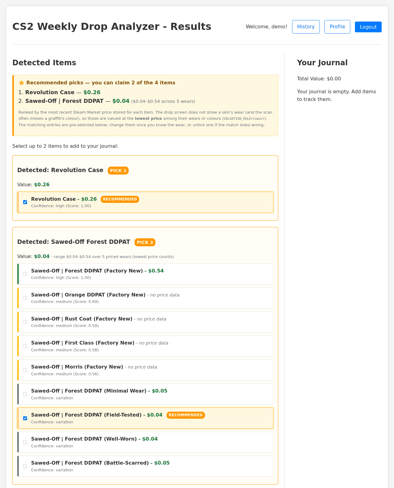

# CS-Weekly-Item-Journal


A Flask app that reads a screenshot of your CS2 weekly care package, works out which four items you were offered, and recommends the two worth claiming based on Steam Market prices. A small YOLO11 model finds the cards, EasyOCR reads their names, and a fuzzy matcher looks them up among ~8,750 items. The items you claim go into a journal that tracks their value week by week.



*Generated by `python tools/render_pipeline.py --db <items db>` from the real pipeline output for `Training_Images/image.png`.*



*The results page for that upload (`tools/render_results_page.py`). The skin's wear is not on the drop screen, so it is valued at its cheapest wear.*

How well it works, measured: [Accuracy](#-accuracy). What the detector is and what it was trained on: [MODEL_CARD.md](MODEL_CARD.md).

## 🚀 Features

* **Panel detection** : a YOLO11s model finds the strip of four item cards in a screenshot
* **Text recognition** : EasyOCR reads the name band of each card; card UI text ("Requires a purchased key to open") is filtered out
* **Item matching** : fuzzy matching against the item database tolerates OCR errors and reports a confidence for each match
* **Price comparison** : values each of the four items and recommends the two worth claiming
* **Daily price crawl** : a scheduled job refreshes Steam Community Market prices for everything the weekly drop can offer
* **User Journal System** : Track your drops over time and monitor your total collection value
* **Drop History & EV** : Per-week charts of value added, cumulative collection value and expected value per drop
* **Web interface** : upload or paste a screenshot, review the matches, add the two you claimed to your journal

## 📋 Overview

This project combines computer vision, deep learning, and web technologies to solve the challenge of tracking weekly drops in Counter-Strike 2.

### The detector

`Models/BOX_TRAINED.pt` is a YOLO11s model with one class, `Box`: the strip
that holds the four item cards. It was fine-tuned in March 2025 on 22
screenshots: 19 for training and 3 for validation, collected from public posts
and in-game captures at many resolutions, including photos of a monitor. Its
validation mAP50 of 0.995 comes from those 3 images, so it says little about
new screenshots. [MODEL_CARD.md](MODEL_CARD.md) has the details and the known
failure cases. The labels and a training script are in
[`dataset/`](dataset/README.md), so the model can be retrained.

### Image Processing Pipeline

1. **Panel detection** : YOLO runs once on the whole screenshot and returns the card strip (highest-confidence box at ≥ 0.4)
2. **Card split** : the strip is cut into four equal columns, one per card
3. **Name band** : each card is cropped to the band 62 %–86 % of its height, where the item name and a second name line sit, and upscaled when the text is small
4. **OCR** : EasyOCR reads each band; lines that are card UI text, not part of the name, are dropped

### Item Matching System

Each OCR text is matched against every item in the database:

* the text is normalised (case, wear names and filler words removed)
* the score blends sequence similarity (50 %), per-word similarity (30 %) and containment (20 %)
* the item type (case, skin, graffiti) is detected from the text and used to rank candidates
* every match gets a confidence (high / medium / low), and low-confidence slots are never recommended
* a matched skin brings all of its wears, and a graffiti whose colour was not read brings all of its colours

### Database System

* A SQLite database of every item the weekly drop can offer: ~6,800 skin/wear rows, cases and capsules, ~1,800 graffiti
* Built from [ByMykel/CSGO-API](https://github.com/ByMykel/CSGO-API) in seconds; prices come from a Steam Market crawl
* Accounts and journals live in the same file

### Web Application

* User registration and authentication
* Screenshot upload via file selection or paste
* Visual results display with confidence indicators
* Personal journal system for tracking drops
* Collection value monitoring
* Recommendation of the two most valuable items (the game lets you claim two)

## 🛠️ Technologies Used

* **Object Detection** : Ultralytics YOLO
* **Computer Vision** : OpenCV, PIL
* **OCR** : EasyOCR
* **Backend** : Python, Flask
* **Database** : SQLite
* **Text Processing** : fuzzy matching built on Python's `difflib`
* **Prices** : Steam Community Market search endpoint (unofficial, unauthenticated)
* **Task Scheduling** : APScheduler
* **Frontend** : Hand-written HTML, CSS and vanilla JavaScript (no framework, no CDN)

## 🔧 Setup and Installation

### Prerequisites

* **Python 3.11, 3.12 or 3.13.** The pipeline needs `ultralytics >= 8.3.94` to
  load the bundled YOLO11 weights, and `numpy >= 1.26` to install at all on
  3.12+.
* A GPU is **not** required. YOLO runs once per screenshot and EasyOCR reads
  four small text bands, which is fine on a CPU.

### Install

```bash
# Clone the repository
git clone https://github.com/Bogzx/CS-Weekly-Item-Journal.git
cd CS-Weekly-Item-Journal

# Create and activate a virtual environment
python -m venv venv
source venv/bin/activate          # Windows: venv\Scripts\activate

# Install dependencies.
# The default PyPI torch build is the CUDA one (~2.5 GB on Linux). This app
# only ever runs inference on small crops, so the CPU build is plenty:
pip install -r requirements.txt --extra-index-url https://download.pytorch.org/whl/cpu

# ...or just this, if you want whatever torch build pip picks by default:
# pip install -r requirements.txt
```

### Configure

```bash
cp .env.EXAMPLE .env

# Generate a real signing key and write it into .env
python -c "import secrets; print('SECRET_KEY=' + secrets.token_hex(32))"
```

Open `.env` and replace the placeholder `SECRET_KEY` line with the generated
one. Everything else has a working default.

### Try the pipeline without the web app

No database or `.env` is needed to see what the model and OCR read:

```bash
python Src/ImageDetector/modified_detect_text.py Training_Images/image.png
# Box 1: Revolution Case
# Box 2: Sawed-Off Forest DDPAT
# Box 3: Sealed Graffiti | Sorry (Bazooka Pink)
# Box 4: Sealed Graffiti Speechless (Princess Pink)
```

The first run downloads EasyOCR's weights (~100 MB). Add `--save-crops` to
write the detected strip, the four cards and the four name bands to `output/`.

### Build the item database

The item list comes from [ByMykel/CSGO-API](https://github.com/ByMykel/CSGO-API),
an MIT-licensed JSON export of the CS2 game files: four downloads from
raw.githubusercontent.com, no Steam requests and no Node.js. Prices come from
the Steam Market and take longer (see below).

All database scripts live in `Src/DB/` and are run from the repository root:

```bash
# 1. Create the empty schema. Refuses to touch an existing database; use
#    --force to rebuild only the item tables (accounts and journals are kept).
python Src/DB/create_database.py

# 2. Download the skin, case and graffiti lists (a few seconds) and write
#    cs_skins.csv, cs_cases.csv, cs_graffiti.csv and cs_tools.csv. Pin a snapshot with
#    --ref <commit>; add --include-knives-and-gloves if you want ★ items too.
python Src/DB/fetch_item_lists.py

# 3. Load them into the database (~6,800 skin/wear rows, 42 cases, 91 sticker
#    capsules, ~1,800 graffiti and the non-tradable Charm Detachment Pack)
python Src/DB/populate_database.py

# 4. Fetch prices for everything the weekly drop can offer: ~900 Steam
#    requests, about 2.5 hours. See "Updating Prices".
python Src/DB/bulk_scraper.py --drop-pool
```

Steps 1–3 take seconds and are covered by an offline test
(`tests/test_item_db_build.py`). Until step 4 has run, uploads work but show
"no price data" and make no recommendation.

Knives and gloves are left out by default: the weekly drop never offers them,
and they share finish names with ordinary skins ("★ Butterfly Knife | Forest
DDPAT"), so they only add wrong match candidates and thousands of rows to price.

### Upgrading a database built with an older version

Back up `csgo_items.db` first. Then:

* **Accounts and journals are kept as they are.** `app.py` adds the new
  columns when it starts. Journal entries store the item's name and price from
  when you added them, so they do not depend on the item tables.
* **Rebuild the item tables. Don't populate on top of the old ones.** Older
  versions built the list from the fandom wiki, which named collections
  differently (graffiti were under "Default Graffiti Collection"), and they
  created all five wears for every skin. Running `populate_database.py` on that
  database adds a second row for most items and keeps rows for wears that don't
  exist. Instead, run `python Src/DB/create_database.py --force`, then steps
  2–4 above. `--force` only drops `items`, `collections` and `test_table`, but
  it also drops the stored prices, so the ~2.5 h price crawl has to run again.
* **History weeks are regrouped.** Weeks are worked out when the page loads,
  and nothing about them is stored. The default now starts each week at the
  CS2 weekly reset (Wednesday 01:00 UTC). Older versions used Monday-based
  weeks, so entries made on a Monday, a Tuesday or early on a Wednesday now
  count towards the previous week. Week labels are ISO week numbers, which can
  be one higher than the old ones for the same dates. `WEEK_BOUNDARY=iso`
  brings back Monday weeks.

### Run

```bash
python app.py
```

Visit `http://127.0.0.1:5000`.

To expose it on a LAN or enable the debugger, use the environment variables
rather than editing the source:

```bash
FLASK_HOST=0.0.0.0 FLASK_PORT=5000 FLASK_DEBUG=1 python app.py
```

`FLASK_DEBUG` is off by default on purpose — Werkzeug's debugger hands out an
interactive Python console on any unhandled exception.

## 📊 Database Structure

The system uses a SQLite database with the following key tables:

* **items** : Stores information about CS2 items (skins, cases, graffiti)
* **collections** : Stores collection names for easier filtering
* **users** : User account information
* **user_journals** : Records of items in users' journals

## 🖼️ Usage

1. **Register/Login** : Create an account to track your drops over time
2. **Upload Screenshot** : Take a screenshot of your CS2 weekly drops screen and upload it
3. **Review Results** : The system identifies items and displays matching candidates with price information
4. **Select Items** : The two most valuable items are marked Pick 1 / Pick 2 and pre-selected (see [How items are valued](#-how-items-are-valued))
5. **Add to Journal** : Confirm the correct items to add to your personal journal
6. **Track Value** : Watch total value and per-drop expected value on the **History** page. Weeks run from one CS2 weekly reset to the next (Wednesday 01:00 UTC; `WEEK_BOUNDARY=iso` for Monday-based ISO weeks)

## 📏 Accuracy

Measured 2026-10-01 over 77 hand-labelled item slots in 20 screenshots
(`tests/fixtures/expected_names.json`). These are the screenshots the detector
was trained on, and the OCR band and matcher thresholds were tuned on them.
**The numbers are in-sample.** There is no held-out test set yet (see below).

| | result | 95 % interval |
|---|---|---|
| panel found | 20 / 20 screenshots | |
| right item named first | 62 / 77 slots (80.5 %) | 66–92 % (bootstrap over screenshots) |
| OCR text exactly right | 21 / 77 (27.3 %) | 14–41 % |

How often the first match was the right item, by the confidence the app shows
next to it:

| shown confidence | slots | right item |
|---|---|---|
| high | 36 | 36 |
| medium | 22 | 21 |
| low (never recommended) | 9 | 5 |
| no match | 10 | 0 |

So a high- or medium-confidence match was right in 57 of 58 cases, and those
cover 75 % of slots. Low-resolution screenshots fail at the OCR step: a 686
px-wide YouTube thumbnail gets 0 of 4. [MODEL_CARD.md](MODEL_CARD.md) lists the
known failure cases and has the exact commands, including a pinned item list.

```bash
python tools/ocr_accuracy.py --db csgo_items.db --split dev   # ~10 min on CPU
```

**Held-out test set.** Add screenshots that were never used for training or
tuning to `tests/fixtures/expected_names.json` with `"split": "test"`, then run
`python tools/ocr_accuracy.py --split test --db csgo_items.db`. That is the
number worth quoting.

## 💲 How items are valued

The care-package screen names each item but does not show a skin's wear, so a
skin slot matches up to five market items (Factory New … Battle-Scarred) whose
prices can differ by 100×. The app:

1. values a slot only over its **top match's own wear variants**, never over
   other items that happened to fuzzy-match the OCR text;
2. shows the price range (min–max over the priced wears) on each slot;
3. counts one price from that range according to `VALUATION_RULE` (in `.env`):

   | `VALUATION_RULE` | Slot value | Use it when |
   |---|---|---|
   | `lowest` (default) | cheapest wear | you want a floor: a pick is worth at least this |
   | `median` | middle wear price | you want a typical value |
   | `highest` | priciest wear (usually Factory New) | the old, optimistic behaviour |

4. recommends the **two** highest-valued slots (the game lets you claim 2 of
   the 4) and pre-selects the entry the value came from. Change it to the real
   wear once you have claimed the item, so the journal records the right price.

Graffiti are treated the same way when the scan misses the colour in brackets
(it usually does): every colour is listed and valued as a range. When the
colour is read, that exact colour is used. Cases have a single price, so the
rule only changes how skins and colour-less graffiti compare to them.

Drop items that cannot be sold (so far only the **Charm Detachment Pack**)
match normally but show **Not tradable — $0** and are never recommended.

## 🔄 Updating Prices

The scheduler runs a daily bulk price update at 00:00 UTC once the app is
running, using `price_update_config.json`. By default (`"drop_pool": true`) it
crawls only what the weekly drop can offer, which is exactly what the database
holds: normal-quality weapon skins, cases and graffiti. That is ~8,900 market
items, ~900 requests, about 2.5 hours. To update manually:

```bash
# Recommended: the weekly-drop pool only (~2.5 hours)
python Src/DB/bulk_scraper.py --drop-pool

# The whole market. Steam returns at most 10 items per request and the scraper
# waits 10 s between pages, so ~35k items take ~10 hours.
python Src/DB/bulk_scraper.py

# Narrow it down: only cases (or graffiti), or a single search term
python Src/DB/bulk_scraper.py --type case
python Src/DB/bulk_scraper.py --query "Revolution Case"

# Only write prices for specific collections (Steam is still crawled in full)
python Src/DB/bulk_scraper.py --collections "Clutch Case" "The Clutch Collection"

# Cap the number of market items fetched
python Src/DB/bulk_scraper.py --drop-pool --max 5000
```

The app picks up new prices on the next upload; no restart is needed.

On HTTP 429 the scraper backs off (60 s, 120 s, honouring `Retry-After`). If
Steam keeps refusing it stops, keeps the prices it already fetched, and exits
with status 1 so the scheduled job logs a failure.

`Src/DB/update_price.py` also exists and updates items one at a time. It sleeps
15 seconds before **every** request, so a full refresh of a 20k-row database
takes over three days. Use it only for a handful of specific items.

### Database verification

```bash
python Src/DB/verify_database.py
```

## ✅ Tests

```bash
pip install pytest
pytest -q
```

`tests/test_golden_image.py` runs the real detection + OCR pipeline against a
committed screenshot and asserts the four item names still come out. It is slow
(it downloads EasyOCR weights on first run) but it catches model-load breakage,
`ultralytics` drift, EasyOCR changes and CS2 UI changes in one assertion.

`tools/ocr_accuracy.py` runs the pipeline over the hand-labelled screenshots
(labels: `tests/fixtures/expected_names.json`, split `dev` or `test`) and
prints OCR accuracy with 95 % intervals; with `--db csgo_items.db` it also
reports how often the app picks the right item, by item type and by shown
confidence (see [Accuracy](#-accuracy)). The slow suite fails if the dev
aggregate drops below the tuned level.

`tests/test_item_db_build.py` builds the item database end to end from
committed ByMykel fixtures (no network) and checks that the result matches
drops and takes Steam prices.

Everything except the golden-image test is fast and needs neither the model
nor the network:

```bash
pytest -q -m "not slow"
```

## 🕳️ Known gaps

* **No held-out test set.** Every accuracy number above is measured on the
  screenshots the pipeline was built and tuned on. The tooling for a test split
  is ready (see [Accuracy](#-accuracy)). It needs new screenshots.
* **Small training set.** The detector saw 22 screenshots. Its labels are
  reconstructed in [`dataset/`](dataset/README.md), and `tools/train_detector.py`
  retrains it. Its 0.995 validation mAP50 comes from 3 images
  ([MODEL_CARD.md](MODEL_CARD.md)).
* **No prebuilt `csgo_items.db` ships.** The item list builds in seconds,
  but the first price crawl takes ~2.5 hours because Steam serves 10 items
  per request. A priced database published as a GitHub Release asset would make
  the first run instant.
* **Built for your own machine or LAN.** Logins are throttled per client IP
  (per /64 for IPv6, in memory; not per account, so a botnet spreading guesses
  over many addresses is not stopped) and every form POST carries a CSRF
  token, but there is no
  HTTPS, no password reset and no account deletion. Put it behind a TLS proxy
  (and set `SESSION_COOKIE_SECURE=True`, and `TRUSTED_PROXIES=1` so the
  login throttle sees real client addresses) before exposing it more widely.

## 🤝 Contributing

Contributions are welcome! Please feel free to submit a Pull Request.

1. Fork the repository
2. Create your feature branch (`git checkout -b feature/amazing-feature`)
3. Commit your changes (`git commit -m 'Add some amazing feature'`)
4. Push to the branch (`git push origin feature/amazing-feature`)
5. Open a Pull Request

## 📜 License

This project is licensed under the MIT License - see the LICENSE file for details.

---

*Note: This project is not affiliated with Valve Corporation or the Counter-Strike franchise. All CS2/CS*

* item names and related data are property of their respective owners.*
